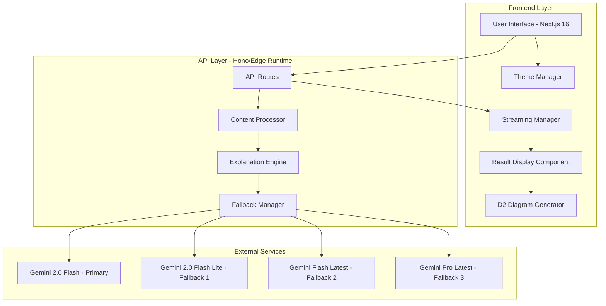

# Design Document: Learning Copilot

## Overview

The Learning Copilot is a sophisticated web application built with Next.js 16 and React 19 that transforms complex content into structured, interactive learning experiences. The system leverages Google's Gemini AI models with a robust fallback mechanism to generate comprehensive explanations tailored to different skill levels, presenting them through an intuitive 3-pane interface with interactive D2 diagrams and real-time streaming capabilities.

The application follows a modern React architecture with TypeScript for type safety, Tailwind CSS v4 for styling, and Framer Motion for smooth animations. The system is designed for reliability with multiple fallback mechanisms, responsive design principles, and uses Hono for efficient API routing with edge runtime support.

## Architecture

### High-Level Architecture



### Component Architecture

The application follows a component-based architecture with clear separation of concerns:

- **Presentation Layer**: React 19 components handling user interface and interactions
- **Business Logic Layer**: Content processing, AI integration, and state management
- **Data Layer**: Hono API routes with edge runtime and external service integration
- **Infrastructure Layer**: Next.js 16 framework, Tailwind CSS v4, and deployment configuration

## Components and Interfaces

### Core Components

#### MainPage Component
```typescript
interface MainPageProps {
  initialTheme?: 'light' | 'dark';
}

interface MainPageState {
  content: string;
  explanationLevel: 'Beginner' | 'Intermediate' | 'Advanced';
  isLoading: boolean;
  result: ExplanationResult | null;
  error: string | null;
}
```

#### ResultDisplay Component
```typescript
interface ResultDisplayProps {
  result: ExplanationResult;
  isStreaming: boolean;
}

interface ExplanationResult {
  mentalModel: string;
  explanation: string;
  example: string;
  diagram: string;
  keyTakeaways: string[];
  metadata: {
    language?: string;
    complexity: string;
    processingTime: number;
  };
}
```

#### D2Diagram Component
```typescript
interface D2DiagramProps {
  chart: string;
  theme?: 'light' | 'dark';
  onError?: (error: Error) => void;
}

interface DiagramState {
  isLoading: boolean;
  error: string | null;
  renderedSvg: string | null;
}
```

### API Interfaces

#### Content Processing API (Hono-based)
```typescript
interface ProcessContentRequest {
  content: string;
  level: 'Beginner' | 'Intermediate' | 'Advanced';
}

interface ProcessContentResponse {
  // Streaming response via ReadableStream
  stream: ReadableStream<Uint8Array>;
  headers: {
    'Content-Type': 'text/plain; charset=utf-8';
    'Transfer-Encoding': 'chunked';
    'X-Model-Used': string;
  };
}
```

#### AI Service Interface with Fallback
```typescript
interface AIServiceConfig {
  models: string[]; // Prioritized list: gemini-2.0-flash, gemini-2.0-flash-lite, etc.
  maxRetries: number;
  timeout: number;
  fallbackStrategy: 'sequential' | 'parallel';
}

interface GenerateExplanationParams {
  content: string;
  level: string;
  systemPrompt: string;
}

interface ModelFallbackResult {
  success: boolean;
  modelUsed: string;
  stream?: ReadableStream;
  error?: Error;
}
```

## Data Models

### Content Models

#### ExplanationResult
```typescript
interface ExplanationResult {
  mentalModel: string;
  explanation: string;
  example: string;
  diagram: string; // D2 diagram code
  keyTakeaways: string[];
  metadata: {
    detectedLanguage?: string;
    complexity: string;
    processingTime: number;
    modelUsed: string;
  };
}
```

#### StreamingContent
```typescript
interface StreamingContent {
  sections: {
    mentalModel: string;
    explanation: string;
    diagram: string;
    example: string;
    takeaways: string;
  };
  isComplete: boolean;
  currentSection: string;
}
```

#### UserPreferences
```typescript
interface UserPreferences {
  theme: 'light' | 'dark';
  explanationLevel: 'Beginner' | 'Intermediate' | 'Advanced';
  diagramPreferences: {
    autoZoom: boolean;
    showControls: boolean;
  };
  animationsEnabled: boolean;
}
```

### Response Models

#### StreamingResponse
```typescript
interface StreamingResponse {
  type: 'chunk' | 'complete' | 'error';
  data: string;
  metadata?: {
    section: 'mentalModel' | 'explanation' | 'example' | 'diagram' | 'takeaways';
    progress: number;
  };
}
```

#### ErrorResponse
```typescript
interface ErrorResponse {
  error: string;
  code: string;
  details?: any;
  fallbackUsed?: boolean;
  retryable: boolean;
}
```

## Correctness Properties

*A property is a characteristic or behavior that should hold true across all valid executions of a system—essentially, a formal statement about what the system should do. Properties serve as the bridge between human-readable specifications and machine-verifiable correctness guarantees.*

### Property 1: Input Validation Consistency
*For any* input content (empty strings, whitespace-only, null values), the Content_Processor should prevent submission and maintain current application state
**Validates: Requirements 1.2.1**

### Property 2: Language Detection Accuracy  
*For any* code snippet containing language-specific syntax patterns, the Language_Detector should correctly identify the programming language or classify as generic text
**Validates: Requirements 1.3.1**

### Property 3: Session State Persistence
*For any* user preference selection (explanation level, theme), the system should maintain that preference throughout all subsequent interactions in the session
**Validates: Requirements 2.2.1**

### Property 4: Structured Content Generation
*For any* explanation request, the Explanation_Engine should generate complete responses containing mental model, detailed explanation, example, valid D2 diagram, and key takeaways sections
**Validates: Requirements 3.2.1, 3.3.1**

### Property 5: AI Service Fallback Mechanism
*For any* primary model failure (rate limiting, service unavailable, timeout), the Fallback_Manager should automatically attempt alternative models in the configured priority order
**Validates: Requirements 3.5.1**

### Property 6: Keyboard Shortcut Handling
*For any* supported keyboard combination (Cmd/Ctrl+V, Cmd/Ctrl+Enter), the Input_Handler should execute the corresponding action regardless of current focus state
**Validates: Requirements 5.1.1**

### Property 7: Real-time Streaming Behavior
*For any* explanation generation, the Streaming_Manager should deliver content incrementally as it becomes available rather than waiting for complete response
**Validates: Requirements 6.1.1**

### Property 8: Theme Application Consistency
*For any* theme toggle action, the Theme_Manager should apply changes immediately across all UI components while maintaining content readability and accessibility standards
**Validates: Requirements 7.2.1**

### Property 9: Responsive Layout Adaptation
*For any* viewport size change, the Layout_Manager should adapt the interface appropriately while maintaining functionality and readability across desktop, tablet, and mobile breakpoints
**Validates: Requirements 8.1.1**

### Property 10: Syntax Highlighting Integration
*For any* code block in explanation content, the Syntax_Highlighter should apply appropriate language-specific styling that works correctly in both light and dark themes
**Validates: Requirements 9.1.1**

### Property 11: Error Recovery and Graceful Degradation
*For any* system error (AI service failure, network timeout, parsing error), the Error_Handler should provide clear user feedback while maintaining application stability and offering recovery options
**Validates: Requirements 10.1.1, 10.2.1**

## Error Handling

### Error Categories

#### Input Validation Errors
- **Empty Content**: Display helpful message prompting user to enter content
- **Invalid Format**: Provide specific feedback about content format issues
- **Content Too Large**: Implement size limits with clear messaging

#### AI Service Errors
- **Model Unavailable**: Automatic fallback to secondary models
- **Rate Limiting**: Implement exponential backoff with user notification
- **Invalid Response**: Retry with different model or display error message

#### Network Errors
- **Connection Timeout**: Retry mechanism with user notification
- **Service Unavailable**: Fallback options and retry suggestions
- **Streaming Interruption**: Graceful recovery and continuation options

#### Rendering Errors
- **Diagram Rendering Failure**: Display error message with diagram source
- **Syntax Highlighting Issues**: Fallback to plain text with notification
- **Theme Application Errors**: Reset to default theme with user notification

### Error Recovery Strategies

#### Automatic Recovery
- Model fallback system for AI service failures
- Retry mechanisms for transient network issues
- Graceful degradation for non-critical features

#### User-Initiated Recovery
- Manual retry buttons for failed operations
- Clear error messages with suggested actions
- Option to report issues for debugging

## Testing Strategy

### Dual Testing Approach

The Learning Copilot requires comprehensive testing using both unit tests and property-based tests to ensure reliability and correctness across all user scenarios.

#### Unit Testing Focus
- **Component Integration**: Test interactions between React components
- **API Endpoint Behavior**: Verify API routes handle requests correctly
- **Error Boundary Functionality**: Test error handling in specific scenarios
- **Theme Switching Logic**: Verify theme changes apply correctly
- **Clipboard Integration**: Test paste functionality with various content types

#### Property-Based Testing Focus
- **Input Processing**: Test content validation across all possible inputs
- **AI Response Handling**: Verify explanation generation with random content
- **UI State Management**: Test state consistency across user interactions
- **Responsive Behavior**: Verify layout adaptation across viewport sizes
- **Streaming Reliability**: Test real-time content delivery under various conditions

### Property-Based Testing Configuration

**Testing Library**: Use `fast-check` for TypeScript/JavaScript property-based testing
**Test Configuration**: Minimum 100 iterations per property test
**Test Tagging**: Each property test must reference its design document property using the format:
```typescript
// Feature: learning-copilot, Property 1: Input Processing Consistency
```

### Testing Implementation Requirements

#### Core Testing Principles
- Each correctness property must be implemented by a single property-based test
- Unit tests complement property tests by focusing on specific examples and integration points
- All tests must be tagged with feature name and property reference
- Property tests should use randomized inputs to achieve comprehensive coverage

#### Test Coverage Goals
- **Functional Coverage**: All user workflows and system behaviors
- **Error Coverage**: All error conditions and recovery mechanisms  
- **Performance Coverage**: Streaming, animations, and responsive behavior
- **Integration Coverage**: AI service integration and fallback mechanisms

**Testing Library**: Use `fast-check` for TypeScript/JavaScript property-based testing
**Test Configuration**: Minimum 100 iterations per property test
**Test Tagging**: Each property test must reference its design document property using the format:
```typescript
// Feature: learning-copilot, Property 1: Input Validation Consistency
```

The testing strategy ensures that the Learning Copilot maintains high reliability while providing a smooth user experience across all supported scenarios and devices.