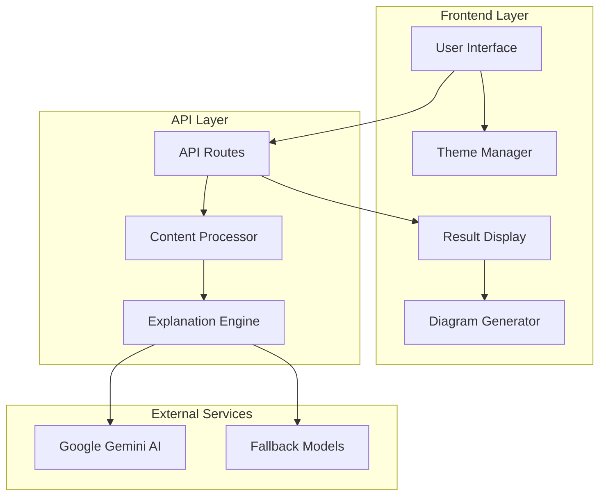

# Design Document: Learning Copilot

## Overview

The Learning Copilot is a sophisticated web application built with Next.js that transforms complex content into structured, interactive learning experiences. The system leverages Google's Gemini AI models to generate comprehensive explanations tailored to different skill levels, presenting them through an intuitive 3-pane interface with interactive diagrams and real-time streaming capabilities.

The application follows a modern React architecture with TypeScript for type safety, Tailwind CSS for styling, and Framer Motion for smooth animations. The system is designed for reliability with fallback mechanisms and responsive design principles.

## Architecture

### High-Level Architecture



### Component Architecture

The application follows a component-based architecture with clear separation of concerns:

- **Presentation Layer**: React components handling user interface and interactions
- **Business Logic Layer**: Content processing, AI integration, and state management
- **Data Layer**: API routes and external service integration
- **Infrastructure Layer**: Next.js framework, build tools, and deployment configuration

## Components and Interfaces

### Core Components

#### MainPage Component
```typescript
interface MainPageProps {
  initialTheme?: 'light' | 'dark';
}

interface MainPageState {
  content: string;
  explanationLevel: 'Beginner' | 'Intermediate' | 'Advanced';
  isLoading: boolean;
  result: ExplanationResult | null;
  error: string | null;
}
```

#### ResultDisplay Component
```typescript
interface ResultDisplayProps {
  result: ExplanationResult;
  isStreaming: boolean;
}

interface ExplanationResult {
  mentalModel: string;
  explanation: string;
  example: string;
  diagram: string;
  keyTakeaways: string[];
  metadata: {
    language?: string;
    complexity: string;
    processingTime: number;
  };
}
```

#### MermaidDiagram Component
```typescript
interface MermaidDiagramProps {
  diagram: string;
  theme: 'light' | 'dark';
  onError?: (error: Error) => void;
}

interface DiagramControls {
  zoom: number;
  pan: { x: number; y: number };
  resetView: () => void;
  zoomIn: () => void;
  zoomOut: () => void;
}
```

### API Interfaces

#### Content Processing API
```typescript
interface ProcessContentRequest {
  content: string;
  explanationLevel: 'Beginner' | 'Intermediate' | 'Advanced';
  language?: string;
}

interface ProcessContentResponse {
  result: ExplanationResult;
  streamId?: string;
}
```

#### AI Service Interface
```typescript
interface AIServiceConfig {
  primaryModel: string;
  fallbackModels: string[];
  maxRetries: number;
  timeout: number;
}

interface GenerateExplanationParams {
  content: string;
  level: string;
  systemPrompt: string;
}
```

## Data Models

### Content Models

#### InputContent
```typescript
interface InputContent {
  text: string;
  type: 'code' | 'concept' | 'text';
  detectedLanguage?: string;
  metadata: {
    length: number;
    complexity: 'low' | 'medium' | 'high';
    timestamp: Date;
  };
}
```

#### ExplanationRequest
```typescript
interface ExplanationRequest {
  content: InputContent;
  level: ExplanationLevel;
  preferences: UserPreferences;
  sessionId: string;
}
```

#### UserPreferences
```typescript
interface UserPreferences {
  theme: 'light' | 'dark';
  explanationLevel: 'Beginner' | 'Intermediate' | 'Advanced';
  diagramPreferences: {
    autoZoom: boolean;
    showControls: boolean;
  };
  animationsEnabled: boolean;
}
```

### Response Models

#### StreamingResponse
```typescript
interface StreamingResponse {
  type: 'chunk' | 'complete' | 'error';
  data: string;
  metadata?: {
    section: 'mentalModel' | 'explanation' | 'example' | 'diagram' | 'takeaways';
    progress: number;
  };
}
```

#### ErrorResponse
```typescript
interface ErrorResponse {
  error: string;
  code: string;
  details?: any;
  fallbackUsed?: boolean;
  retryable: boolean;
}
```

## Correctness Properties

*A property is a characteristic or behavior that should hold true across all valid executions of a system—essentially, a formal statement about what the system should do. Properties serve as the bridge between human-readable specifications and machine-verifiable correctness guarantees.*

### Property 1: Input Processing Consistency
*For any* valid text, code, or concept input, the Content_Processor should accept, validate, detect language (when applicable), and prepare it for explanation processing
**Validates: Requirements 1.2, 1.3, 1.4**

### Property 2: Session State Persistence  
*For any* user preference selection (explanation level, theme), the system should store and maintain that preference throughout the current session
**Validates: Requirements 2.2, 7.3**

### Property 3: Explanation Level Adaptation
*For any* content and selected explanation level, the generated explanation should match the complexity appropriate to that level
**Validates: Requirements 2.3**

### Property 4: AI Service Integration
*For any* content submission, the Explanation_Engine should process it using the configured AI models and handle fallback when the primary model fails
**Validates: Requirements 3.1, 3.5, 10.1**

### Property 5: Structured Output Generation
*For any* explanation request, the system should generate a complete response containing mental model, detailed explanation, example, valid Mermaid diagram, and key takeaways
**Validates: Requirements 3.2, 3.3, 3.4**

### Property 6: UI Layout Consistency
*For any* generated explanation, the Result_Display should present content in a 3-pane layout with sticky mental model header, organized tabs, and collapsible takeaways
**Validates: Requirements 4.1, 4.2, 4.3, 4.5**

### Property 7: Diagram Interactivity
*For any* displayed Mermaid diagram, the Diagram_Generator should provide full interactivity including zoom controls, pan functionality, and responsive rendering
**Validates: Requirements 4.4, 5.1, 5.2, 5.3, 5.5**

### Property 8: Error Handling Gracefully
*For any* error condition (diagram rendering failure, network error, invalid input, system error), the system should handle it gracefully with appropriate messages while maintaining stability
**Validates: Requirements 5.4, 10.2, 10.3, 10.5**

### Property 9: Streaming Behavior
*For any* explanation generation, the system should stream content in real-time, display loading indicators, handle interruptions gracefully, and indicate completion
**Validates: Requirements 6.1, 6.2, 6.4, 6.5**

### Property 10: Theme Application Consistency
*For any* theme toggle, the Theme_Manager should apply changes immediately across all UI components, ensure content readability, and provide smooth transitions
**Validates: Requirements 7.2, 7.4, 7.5**

### Property 11: Responsive Design Adaptation
*For any* device type (desktop, tablet, mobile), the application should provide responsive design with appropriate animations and maintained readability
**Validates: Requirements 8.1, 8.3, 8.5**

### Property 12: Animation Integration
*For any* user interaction or content change, the system should provide Framer Motion animations that enhance experience without interfering with functionality
**Validates: Requirements 8.2**

### Property 13: Syntax Highlighting Consistency
*For any* code snippet display, the system should apply appropriate syntax highlighting with proper formatting that works across multiple languages and both themes
**Validates: Requirements 9.1, 9.2, 9.3, 9.4, 9.5**

### Property 14: Privacy-Preserving Error Logging
*For any* error occurrence, the system should log debugging information while maintaining user privacy and data protection
**Validates: Requirements 10.4**

## Error Handling

### Error Categories

#### Input Validation Errors
- **Empty Content**: Display helpful message prompting user to enter content
- **Invalid Format**: Provide specific feedback about content format issues
- **Content Too Large**: Implement size limits with clear messaging

#### AI Service Errors
- **Model Unavailable**: Automatic fallback to secondary models
- **Rate Limiting**: Implement exponential backoff with user notification
- **Invalid Response**: Retry with different model or display error message

#### Network Errors
- **Connection Timeout**: Retry mechanism with user notification
- **Service Unavailable**: Fallback options and retry suggestions
- **Streaming Interruption**: Graceful recovery and continuation options

#### Rendering Errors
- **Diagram Rendering Failure**: Display error message with diagram source
- **Syntax Highlighting Issues**: Fallback to plain text with notification
- **Theme Application Errors**: Reset to default theme with user notification

### Error Recovery Strategies

#### Automatic Recovery
- Model fallback system for AI service failures
- Retry mechanisms for transient network issues
- Graceful degradation for non-critical features

#### User-Initiated Recovery
- Manual retry buttons for failed operations
- Clear error messages with suggested actions
- Option to report issues for debugging

## Testing Strategy

### Dual Testing Approach

The Learning Copilot requires comprehensive testing using both unit tests and property-based tests to ensure reliability and correctness across all user scenarios.

#### Unit Testing Focus
- **Component Integration**: Test interactions between React components
- **API Endpoint Behavior**: Verify API routes handle requests correctly
- **Error Boundary Functionality**: Test error handling in specific scenarios
- **Theme Switching Logic**: Verify theme changes apply correctly
- **Clipboard Integration**: Test paste functionality with various content types

#### Property-Based Testing Focus
- **Input Processing**: Test content validation across all possible inputs
- **AI Response Handling**: Verify explanation generation with random content
- **UI State Management**: Test state consistency across user interactions
- **Responsive Behavior**: Verify layout adaptation across viewport sizes
- **Streaming Reliability**: Test real-time content delivery under various conditions

### Property-Based Testing Configuration

**Testing Library**: Use `fast-check` for TypeScript/JavaScript property-based testing
**Test Configuration**: Minimum 100 iterations per property test
**Test Tagging**: Each property test must reference its design document property using the format:
```typescript
// Feature: learning-copilot, Property 1: Input Processing Consistency
```

### Testing Implementation Requirements

#### Core Testing Principles
- Each correctness property must be implemented by a single property-based test
- Unit tests complement property tests by focusing on specific examples and integration points
- All tests must be tagged with feature name and property reference
- Property tests should use randomized inputs to achieve comprehensive coverage

#### Test Coverage Goals
- **Functional Coverage**: All user workflows and system behaviors
- **Error Coverage**: All error conditions and recovery mechanisms  
- **Performance Coverage**: Streaming, animations, and responsive behavior
- **Integration Coverage**: AI service integration and fallback mechanisms

The testing strategy ensures that the Learning Copilot maintains high reliability while providing a smooth user experience across all supported scenarios and devices.